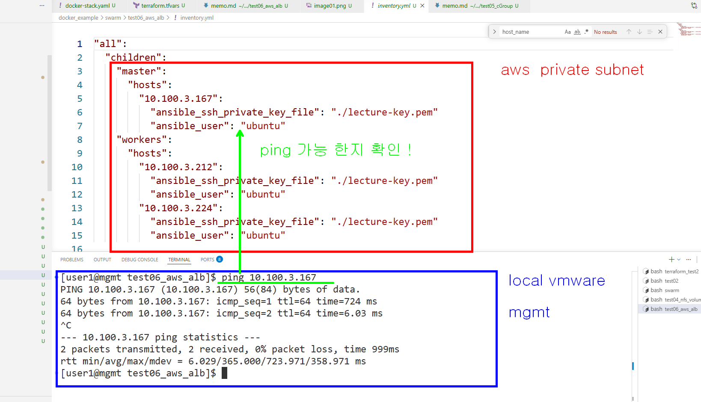
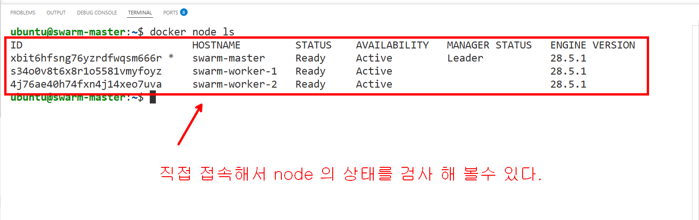
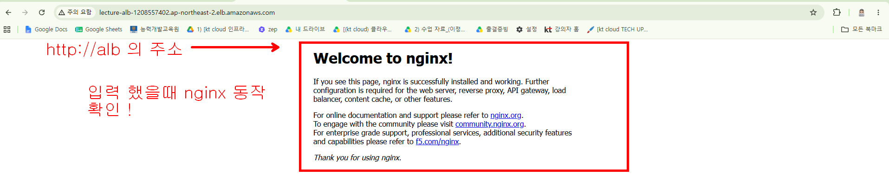

# swarm/test06_aws_alb (swarm 구현)

### aws swarm 클러스터 테스트










### docket context 확인 및 추가

```bash
docker context ls
NAME        DESCRIPTION                               DOCKER ENDPOINT               ERROR
default *   Current DOCKER_HOST based configuration   unix:///var/run/docker.sock

# 위에 보면 default context 에 * 가 있고 default context 를 사용하는 것을 알 수 있다.

# aws swarm-master node 의 접속 정보를 ~/.ssh/config 파일에 추가 해야한다
# ~/.ssh/config 다음 내용 추가 (HostName - ec2 사설 IP 주소 : 매번 바뀜)
Host swarm-master
    HostName 10.100.3.131
    User ubuntu
    IdentityFile ~/docker_example/swarm/test06_aws_alb/lecture-key.pem
    StrictHostKeyChecking no

# context 도 추가 한다 
# create <context 이름>은 마음대로 : <swarm-master>
docker context create swarm-master --docker "host=ssh://swarm-master"

# 만들어진 context 목록 확인
docker context ls
NAME           DESCRIPTION                               DOCKER ENDPOINT               ERROR
default *      Current DOCKER_HOST based configuration   unix:///var/run/docker.sock   
swarm-master                                             ssh://swarm-master

# swarm-master context 사용
docker context use swarm-master

# context 확인
docker context ls
NAME             DESCRIPTION                               DOCKER ENDPOINT               ERROR
default          Current DOCKER_HOST based configuration   unix:///var/run/docker.sock   
swarm-master *                                             ssh://swarm-master

# aws node 확인 (mgmt 에서 aws-swarm master docker 명령어 전달 가능)
docker node ls
ID                            HOSTNAME         STATUS    AVAILABILITY   MANAGER STATUS   ENGINE VERSION
vujpj0wxvx1kv5k16wuy8rj3n *   swarm-master     Ready     Active         Leader           28.5.1
wnuecpa5tb8sj1fgdj8xg72w0     swarm-worker-1   Ready     Active                          28.5.1
0ie78odqnghzri7d6fbcb1yo0     swarm-worker-2   Ready     Active                          28.5.1

# 다시 default context 사용
docker context use default

```

### aws 에서 portainer 를 실행하고 window 에서 port forward 를 이용해서 접속해보기

```bash
# window 에서 command 창을 열어서 아래의 정보를 입력한다
# ssh -L 9443:<swarm master 의 ip>:9443 user1@172.16.8.200
# L 은 Local forwarding --> window 의 9443 port 를 user1@172.16.8.200 을 통해서
# 10.100.3.131 port 로 forwarding 하겠다는 의미
ssh -L 9443:10.100.3.131:9443 user1@172.16.8.200 # 비번 : user1

# mgmt 의 docker context 를 swarm-master 로 변경하고 portainer stack 을 배포한다
docker context use swarm-master
docker stack deploy -c portainer-agent-stack.yml  portainer

# 배포한 다음 5분 이내에 window 에서 웹브라우저를 열어서 아래의 주소로 접속해본다 (ssh -L 9443:10.100.3.131:9443 user1@172.16.8.200 입력한 window cmd 창을 열어놓아야 portainer 가 동작된다 )
https://localhost:9443


# port forwarding background 에서 실행
ssh -N -f -L 9443:10.100.3.131:9443 user1@172.16.8.200
# port forwarding background 프로세스를 찾아서 종료하기
netstat -ano | findstr 9443
# 위를 실행해서 9443 port 를 사용하는 프로세스 번호를 찾아서 없애기 (taskkill /f /pid 프로세스 번호[3번째 열 번호]) 
taskkill /f /pid 11716

```

### 배포한 서비스 제어

```bash
# 우리는 위에서 아래의 서비스를 배포했다
docker service create --name my-web --replicas 1 -p 80:80 nginx

# 배포한 서비스 목록 확인
docker service ls

# 서비스 replica 변경
docker service scale my-web=2

# 서비스 삭제
docker service rm my-web
```

### 실습 후에 terraform destroy 하고 정리 작업하기

- tailscale api console 에서 swarm-master remove(삭제)하기
- docker context 를 default 로 변경
- swarm-master docker context 삭제 (선택사항 - ip 교체하면 재활용 가능)

```bash
# default context 를 사용하도록 변경
docker context use default

# 변경 되었는지 확인
docker context ls
NAME           DESCRIPTION                               DOCKER ENDPOINT               ERROR
default *      Current DOCKER_HOST based configuration   unix:///var/run/docker.sock   
swarm-master                                             ssh://swarm-master 
```