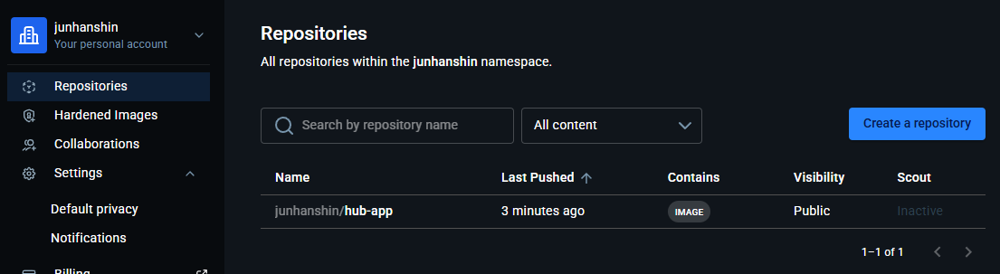

# test09_dockerhub/memo.md

### docker hub 사용하기

```bash

# 이미지를 빌드하고 docker hub 에 올리기
# docker longin -u junhanshin
# docker build -t <도커허브아이디>/<이미지이름>:<태그>
docker build -t junhanshin/hub-app:1.0 .

# docker push <도커허브아이디>/<이미지이름>:<태그>
# 이미 로그인 되어 있는 상태라면 그냥 올라가고, 로그인 안되어 있으면 로그인 해야된다
docker push junhanshin/hub-app:1.0

# /src/main.py 내용 추가(수정)
docker build -t junhanshin/hub-app:1.1 .
# 수정된 내용 다시 push
docker push junhanshin/hub-app:1.1

# 특정 이미지 삭제
docker image rm 이미지명
docker image rm junhanshin/hub-app:1.0

# 로컬에서는 junhanshin/hub-app:1.0 버전을 지웠지만
# docker hub 에는 junhanshin/hub-app:1.0 버전 push 했기 때문에
# 이미지를 docker hub 로 부터 pull (다운로드 하기)
docker pull junhanshin/hub-app:1.0

# 다른 사람의 이미지를 나의 docker hub 로 올리기 위해 tag 변경하기
docker tag <타인 아이디>/hub-app:1.0 junhanshin/hub-app:1.0

# shell 에서 docker hub 이미지 삭제하기
# docker hub access token 준비한다

# 1. 비밀번호 대신 Access Token(PAT)을 넣어 JWT 임시 통행증 발급
TOKEN=$(curl -s -H "Content-Type: application/json" -X POST -d '{"username": "내계정아이디", "password": "발급받은_Access_Token"}' https://hub.docker.com/v2/users/login/ | jq -r .token)

# 2. 통행증(TOKEN)을 이용해 이미지 강제 삭제 슛!
curl -i -X DELETE -H "Authorization: JWT $TOKEN" https://hub.docker.com/v2/repositories/내계정아이디/저장소이름/tags/태그이름/

# 나의 docker hub 의 hup-app:1.0 삭제하기
curl -i -X DELETE -H "Authorization: JWT $TOKEN" https://hub.docker.com/v2/repositories/junhanshin/hub-app/tags/1.0/


```

